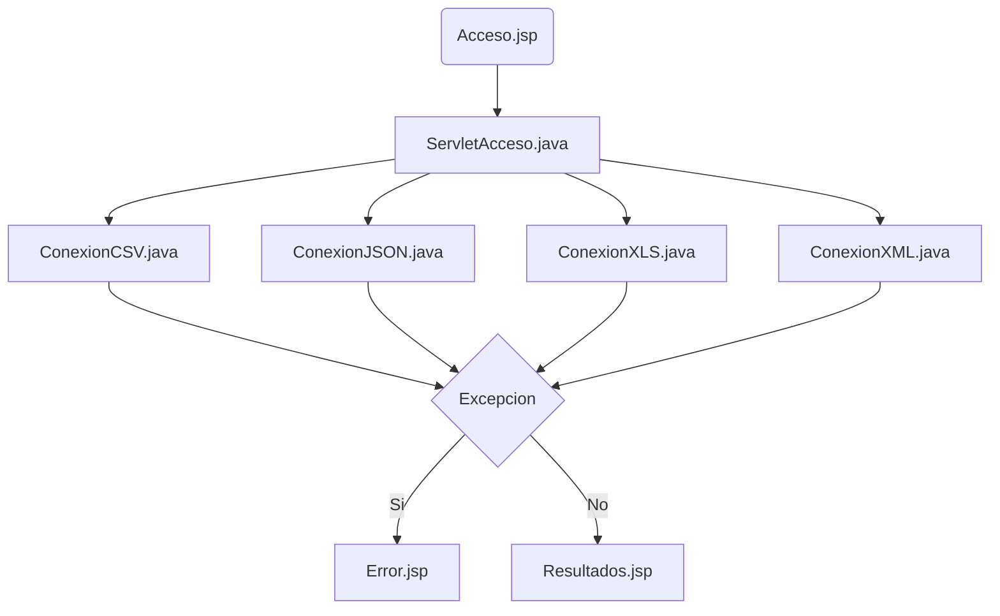

# AD-Manejo-de-Ficheros
Realizar lectura y escritura de ficheros XLS, CSV, JSON y XML con DOM en Java.
---
### Estructura del proyecto:

---
### Integrantes del proyecto:
- **Rubén Alfonso Gonzalo**
- **Noel Prieto Pardo**
- **Adrián del Bosque Vicente**
- **Luis Fernández Castelo**
---
Reparto de las tareas: [Cronograma Jira](https://luisfernandezlf70.atlassian.net/jira/software/projects/AD/boards/1/timeline?shared=&atlOrigin=eyJpIjoiZTg4NGMyZDExNDBiNDgwOTkzNjZjYTFmYTZlOGVkYzgiLCJwIjoiaiJ9)
 

Página de datos abiertos utilizados: [Desfibriladores en Alcobendas](https://datos.gob.es/es/catalogo/l01280066-desfibriladores-en-alcobendas1)
