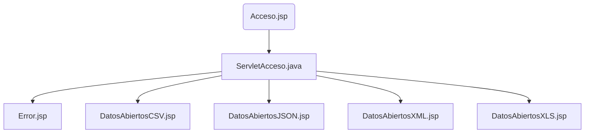

# AD-Manejo-de-Ficheros
Realizar lectura y escritura de ficheros XLS, CSV, JSON y XML con DOM en Java.
---
### Estructura del proyecto:

---
### Integrantes del proyecto:
- **Rubén Alfonso Gonzalo**
- **Noel Prieto Pardo**
- **Adrián del Bosque Vicente**
- **Luis Fernández Castelo**
---
Reparto de las tareas: [Gantt](https://luisfernandezlf70.atlassian.net/jira/software/projects/AD/boards/1/timeline?selectedIssue=AD-31&timeline=WEEKS&shared=&atlOrigin=eyJpIjoiMWU1NjRkMzFlMzBkNGEyZDg5MWY0YjA1MTVmNTZjZWUiLCJwIjoiaiJ9)
---
Página de datos abiertos utilizados: https://datos.gob.es/es/catalogo/l01280066-desfibriladores-en-alcobendas1
